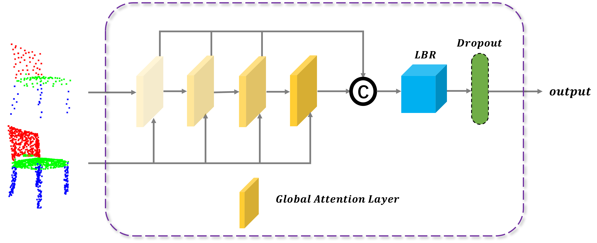
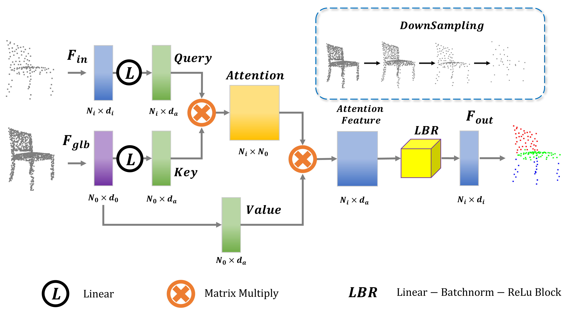

# LrASBlock

Our pretrained model achieves the following performances on :

**Enhancing U-Net with Attention Skip Block for 3D Point Cloud Segmentation** (https://github.com/Ysc156/ASBlock)

## Results

### [3D Part Segmentation on ShapeNetPart](https://paperswithcode.com/sota/3d-part-segmentation-on-shapenet-part)

|                                                  Model name                                                   |    class mIoU     |   Instance mIoU   | 
|:-------------------------------------------------------------------------------------------------------------:|:-----------------:|:-----------------:|
|  [PointNet++ + LrASBlock](https://drive.google.com/drive/folders/12ToS0wrfljTAxSdYSPaYFRuWSzWQKJcr?usp=sharing)  |   82.8%(+0.3%)    |   86.3%(+0.9%)    |
|  [CurveNet + LrASBlock](https://drive.google.com/drive/folders/12vuAIEn2F3NGWzi3YDwnI-9gOJHfmeWl?usp=sharing)   |   83.9%(+0.4%)    |   86.8%(+0.4%)    |
| [PointStack + LrASBlock](https://drive.google.com/drive/folders/1jZB-5Jq4IGN8_K4Rz9tltQwNfpF8CEV3?usp=sharing)  |   82.9%(+1.0%)    |   87.7%(+0.5%)    |

### [Semantic Segmentation on S3DIS Area5](https://paperswithcode.com/sota/semantic-segmentation-on-s3dis-area5)

|                                                     Model name                                                      |     Mean IoU      | Class Mean Accuracy  | Overall Accuracy  |
|:-------------------------------------------------------------------------------------------------------------------:|:-----------------:|:--------------------:|:-----------------:|
|      [KPConv + LrASBlock](https://drive.google.com/drive/folders/1qWY7UaAmgviy7ycHRPRj-sL4PG4zfExS?usp=sharing)       |   67.9%(+1.2%)    |     73.5%(+1.4%)     |   90.2%(+0.3%)    |
| [Point Transformer + LrASBlock](https://drive.google.com/drive/folders/1xMPEHWA9xO1FzLmMhK1oiIQIXFVMCbMx?usp=sharing)  |   71.4%(+0.9%)    |     78.1%(+1.4%)     |   91.2%(+0.5%)    |
| [Stratified Transformer + LrASBlock](https://drive.google.com/drive/folders/1xMPEHWA9xO1FzLmMhK1oiIQIXFVMCbMx?usp=sharing)  |   73.2%(+0.3%)    |     79.7%(+2.3%)     |   91.9%(+0.4%)    |
## Acknowledgement

This code is derived from e.g., [Pointnet_Pointnet2_pytorch](https://github.com/yanx27/Pointnet_Pointnet2_pytorch), [CurveNet](https://github.com/tiangexiang/CurveNet), [PointStack](https://github.com/LongerVision/PointStack), [KPConv-PyTorch](https://github.com/HuguesTHOMAS/KPConv-PyTorch), [point-transformer](https://github.com/POSTECH-CVLab/point-transformer) [Stratified-Transformer](https://github.com/dvlab-research/Stratified-Transformer), and inspirited by several repos, e.g., [PCT](https://github.com/MenghaoGuo/PCT), [spotr](https://github.com/mlvlab/spotr).
